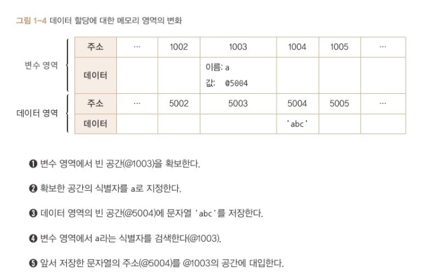

처음으로 책을 읽고 정리하는 글을 작성한다.
첫글이니 만큼 내가 책을 읽고 어떤 내용을 적을지 부터 정의하겠다.

우선 단편적인 정보 정리 최대한 지양하겠다. 그런 내용이라면 인터넷에 얼마든지 있고,
내게 별 도움이 안될것이다.

배운 내용을 내 방식으로 다시 표현해보고, 재미있는 키워드는 조금 더 깊게 찾아보면서 글을 작성하는 방식으로 진행해볼 예정이다.

<hr/>

## 식별자와 변수

우선 식별자와 변수명을 구분할 줄 알아야 한다.

```javascript
const hive = "bee";
```

예를 들어 위와 같은 코드가 있다면 다음과 같은 뜻이다
`const라는 변수 선언문으로 hive라는 이름을 가진 변수를 생성한다`
여기서 "hive라는 이름"은 곧 식별자이고,
"hive라는 이름"을 가지고 'bee'라는 문자열 데이터를 할당받고 있는것은 변수이다.
식별자 = 변수의 이름이라고 봐도 무방하다.

우리는 이제 'bee'라는 문자열 데이터를 담은 변수를 식별자 `hive`를 통해 접근할 수 있는것이다.

식별자와 변수를 구분하는게 얼핏 보면 당연해 보이기도 하고 중요한가 싶기도 하다.

나중에 다루겠지만 컨텍스트가 생성될때 enviroment에 컨텍스트 내부의 식별자 정보들이 저장된다.
여기서 식별자 정보들이 저장된다는 것을 잘 염두해 둬야 한다.
식별자와 변수를 저장한다는 것은 큰 차이가 있고 여기서 잘 이해해두지 않으면
실행컨텍스트를 이해할 때 어려움이 생길 수 있다.

## 변수 영역과 데이터 영역



이 책의 저자는 js는 변수영역과 데이터 영역을 나눈뒤 식별자 정보는 변수 영역에, 실제 데이터는 데이터 영역에 저장한다고 설명한다. 이 개념은 저자가 설명을 위해 임의로 만들어낸 개념임을 유의하며 이해해보자.

그 이유는 다음과 같이 2가지 이유가 있다고 생각한다.

1. 변수의 크기는 불명확하다.

   JS에서 변수는 동적으로 데이터 크기가 변할 수 있다. 따라서 우리는 하나의 변수에 숫자형 데이터 또는 문자열 데이터를 저장할 수 있다. 그렇기 때문에 변수가 차지하는 메모리 공간은 가변적이다. 런타임에서도 얼마든지 이런 현상이 발생할 수 있기 때문에 식별자와 데이터를 분리하여 저장한다. 변수 영역에서 데이터를 바로 저장하면 변수가 바뀔때마다 메모리의 영역을 계산하고 주소값을 재할당해야 할 것이다. 이를 방지하기 위해 변수영역과 데이터 영역을 나눈 것이다.
   <br/>

2. 값 재할당

   ```javascript
   let bee1 = 10;
   let bee2 = 10;
   ```

   위와 같은 코드에서 js는 bee2를 위한 10이라는 숫자형 데이터를 할당할 때, 이미 메모리 상에 bee1를 위한 10데이터가 존재하기 때문에 메모리를 새로 할당하지 않고 bee1의 변수영역이 갖고 있는 같은 메모리 주소값을 bee2의 변수영역에 할당한다.

   만약 데이터를 변수영역과 데이터영역을 분리하지 않았다면 어떻게 됐을까?

   ```javascript
   let bee1 = 10
   let bee2 = 10
   .
   .
   .
   let bee99 = 10
   let bee100 = 10
   ```

   이러한 코드가 존재했다면 같은 데이터를 위해 100개의 숫자형 데이터(js의 경우 8byte)를 위한 메모리가 할당되어 심각한 비효율을 초래했을것이다.

#### const에 대한 이해

그렇다면 우리는 여기서 더 나아가서 const에 대해 이해할 수 있을 것이다.

```javascript
const bee = "love honey";
bee = "can fly"; // TypeError: Assignment to constant variable.
```

위와 같이 const로 선언한 변수에 다른 값을 재할당하면 오류가 난다.
const는 바로 변수 영역에 저장된 데이터 영역의 주소 값을 바꿀수 없다는 것이다.

다시 말해서, const로 선언된 변수는 하나의 데이터 영역 메모리 주소를 가지고 그 값은 바꿀 수 없다.

```javascript
var flower
let hive
const bee // Uncaught SyntaxError: Missing initializer in const declaration
```

위와 같이 const는 var, let과 달리 선언과 할당을 분리할 수 없는 이유도 여기에 있다.
const로 선언된 변수는 선언과 동시에 데이터를 할당받지 못하면 이후에 메모리 주소값을 변경할 수 없기 때문에 undefind값 밖에 가지지 못하는 의미없는 변수가 될 것이다.
이를 방지하기 위해 js에서 에러를 일으키는게 아닐까 생각한다.
